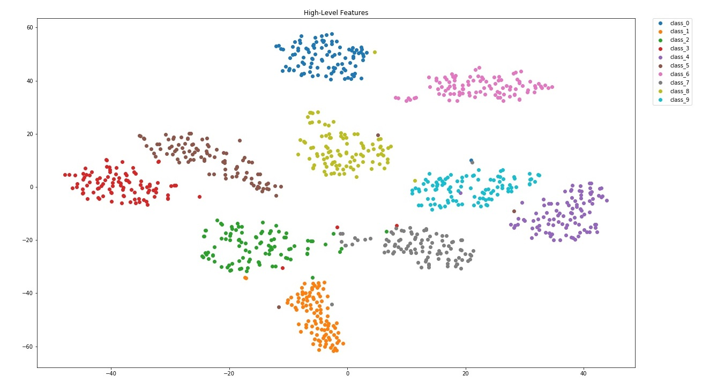

<h1>Handwritten Digit Recognition</h1>

<h3>Goal</h3>
<ul>
  <li>Build a CNN model and train it on MNIST dataset</li>
  <li>Visualize the filter in different layers</li>
  <li>Visualize the low-level and high-level features</li>
</ul>

<h3>Dataset</h3>
<ul>
  <li><b>MNIST</b> : http://yann.lecun.com/exdb/mnist/</li>
</ul>

<h3>Model</h3>

 
　<b>Parameters:</b> 
　-- learning rate = 0.0001　　-- batch size = 256　　-- epoch = 100 

<h3>Learning Curve</h3>
　Training Accuracy & Loss  
 

　Training   Accuracy = 1.0 
　Validation Accuracy = 0.9928  

<h3>Filter Visualization</h3>
　The first convolutional layers (total 32 filters) 

　The last convolutional layers (total 128 filters) 

<h3>Feature Visualization</h3>
　The Low-Level Features 
 

　The High-Level Features 
 

 

<h2>References</h2>

<ul>
  <li><a href="https://blog.keras.io/how-convolutional-neural-networks-see-the-world.html" rel="nofollow">
    How Convolutional Neural Networks See the World</a>
  </li>
</ul>
