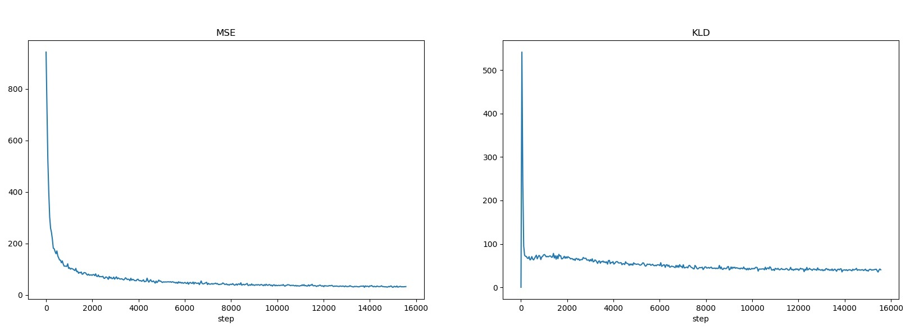
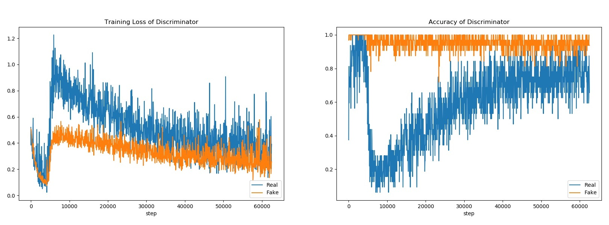
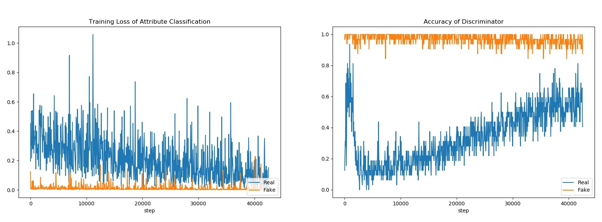

<h1>Image Generation and Feature Disentanglement</h1>

<h3>Goal</h3>
<ul>
  <li>Ability to handle large-scale human face data with deep neural network</li>
  <li>Learn and implement well-known image generation models</li>
  <li>Gain experience of adversarial training</li>
  <li>Supervised/unsupervised feature disentanglement</li>
</ul>

<h3>Dataset</h3>
<ul>
  <li>CelebA</b>: http://mmlab.ie.cuhk.edu.hk/projects/CelebA.html</li>
</ul>
 

<h2>VAE (Variational Auto-Encoder)</h2>

<h3>Model</h3>

 
　<b>Parameters:</b> 
　-- lambda_KL = 0.001　-- learning rate = 0.001　　-- batch size = 128　　-- epoch = 50 

<h3>Training</h3>

<h3>Learning Curve</h3>
　MSE (Reconstruction loss) & KL Divergence 

<h3>Reconstruction Results</h3>
　Testing Images & the Reconstructed Results  

 
　Testing MSE = 0.261635  

<h2>GAN (Generative Adversarial Network)</h2>

<h3>Model</h3>

 
　<b>Parameters:</b> 
　-- learning rate of G = 0.001　　-- learning rate of D = 0.003　　-- batch size = 32　　-- epoch = 50 

<h3>Training</h3>

<h3>Learning Curve</h3>
　Training Loss & Accuracy

<h3>Generated Results</h3>
　Random Generated Images  

 

<h2>ACGAN (Auxiliary Classifier Generative Adversarial Network)</h2>

<h3>Model</h3>

 
　<b>Parameters:</b> 
　-- learning rate of G = 0.001　　-- learning rate of D = 0.003　　-- batch size = 32　　-- epoch = 34  

　<b>Attribute:</b> Smiling 

<h3>Training</h3>

<h3>Learning Curve</h3>
　Training Loss of Attribute Classification and Accuracy of Discriminator 

<h3>Generated Results</h3>
　Random Generated Images (Attribute: Smiling & No Smiling)   

 

<h2>References</h2>

<ul>
  <li><a href="https://www.oreilly.com/learning/generative-adversarial-networks-for-beginners?imm_mid=0f3eba&cmp=em-data-na-na-newsltr_20170628" rel="nofollow">
    Generative Adversarial Networks for beginners</a>
  </li>
  <li><a href="https://gluon.mxnet.io/chapter14_generative-adversarial-networks/dcgan.html" rel="nofollow">
    Deep Convolutional Generative Adversarial Networks</a>
  </li>
  <li><a href="https://github.com/jonbruner/generative-adversarial-networks" rel="nofollow">
      jonbruner/generative-adversarial-networks</a>
  </li>
</ul>
