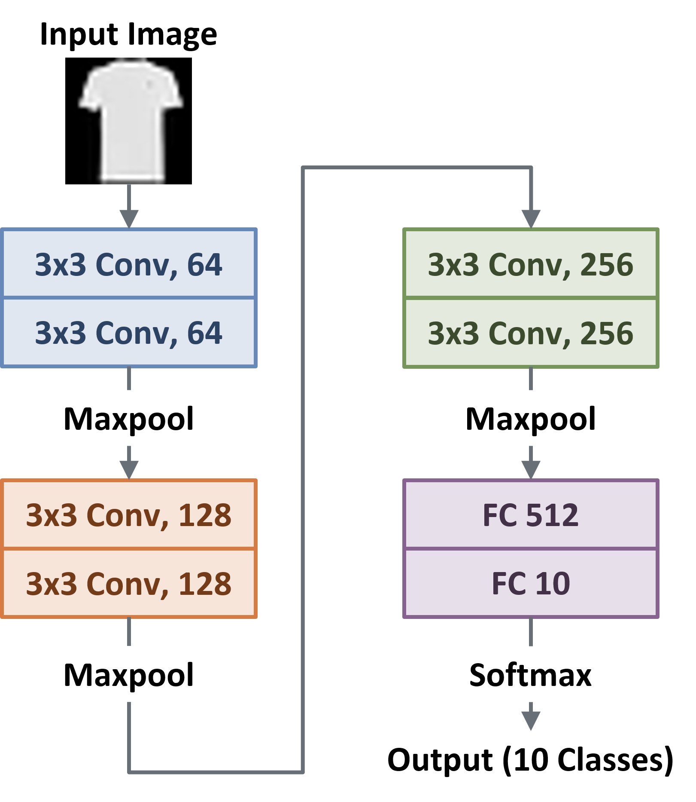
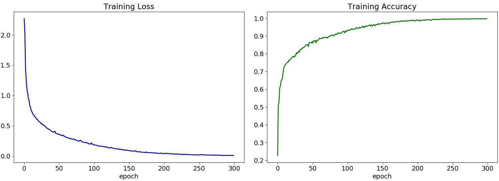
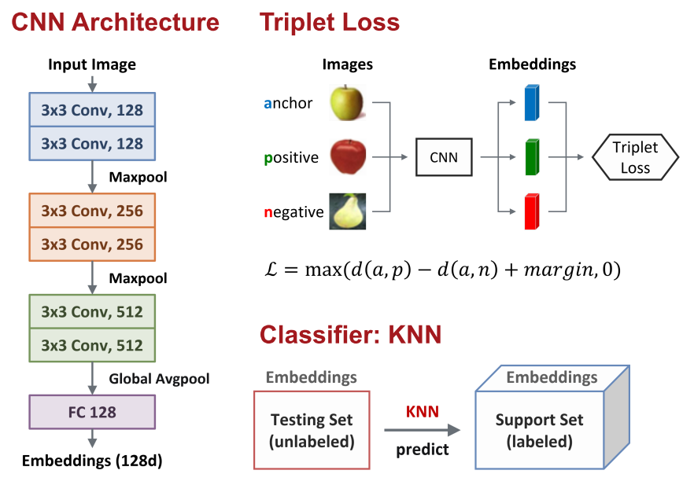
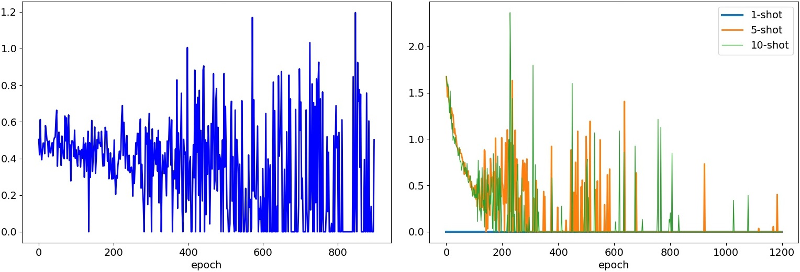
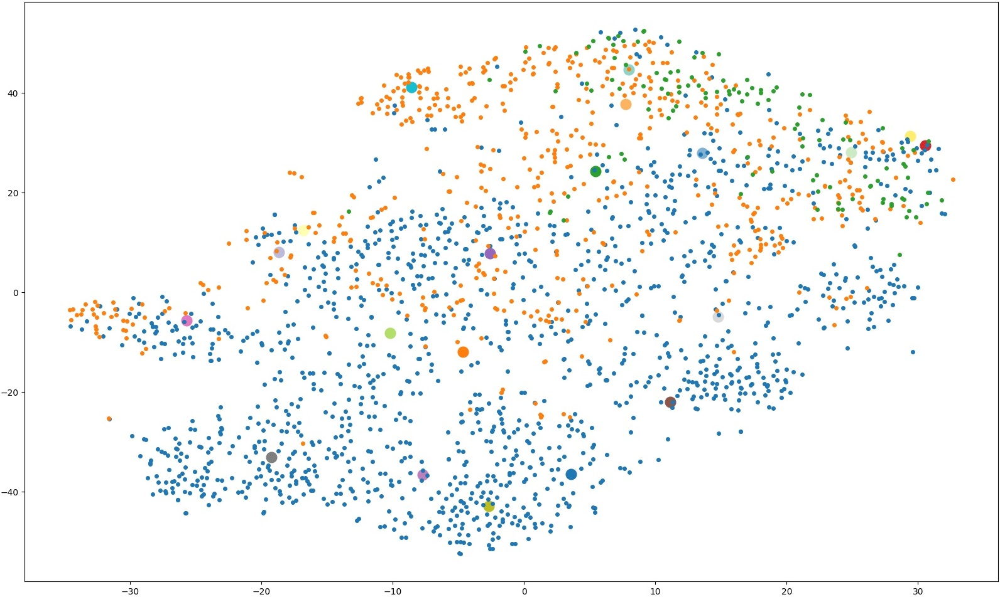
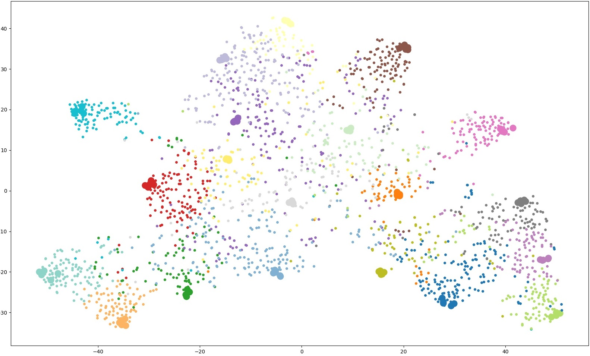
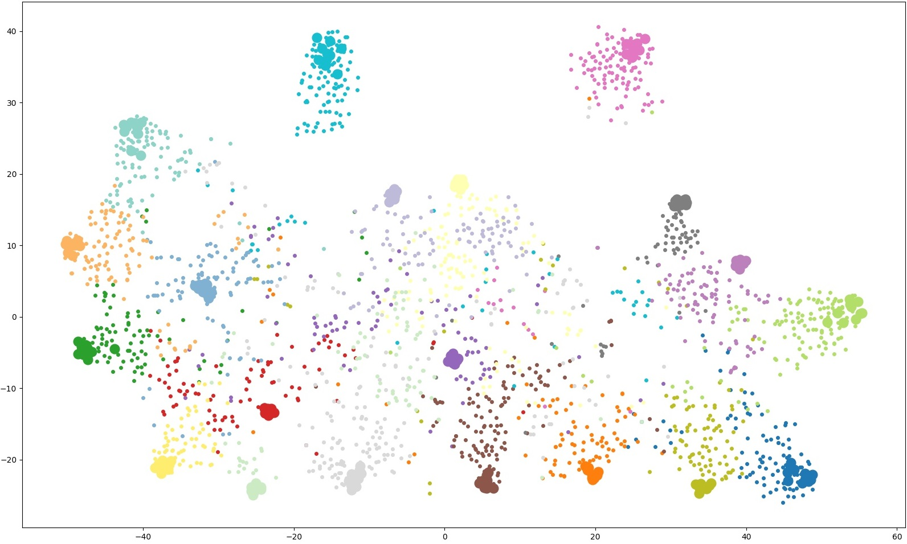

<h1>Object Recognition</h1>

<h3>Task</h3>
<ul>
  <li>Task 1: Training with a Small Amount of Data</li>
  <li>Task 2: One-Shot / Few-Shot / Low-Shot Learning</li>
</ul>

 

<h2>Task 1 : Training with a Small Amount of Data</h2>
<ul>
  <li>Train a classifier to beat Microsoft Custom Vision AI baseline</li>
  <li>Use a limited version of Fashion MNIST dataset</li>
</ul>

<h3>Dataset</h3>

　<b>Fashion Mnist (Simplified)</b> : https://github.com/zalandoresearch/fashion-mnist 
 
<ul>
  <li>Training / Testing: <b>2K labeled</b> / 10K unlabeled images</li>
  <li>The images are split equally in <b>10 classes</b></li>
</ul>

<h3>Method : Simple CNN Model</h3>

　<b>Parameters:</b> 
　-- learning rate = 0.0001　　-- batch size = 128　　-- epoch = 300  

<h3>Learning Curve</h3>
　Training Loss & Training Accuracy  

<h3>Testing Results</h3>
<table>
  <thead>
    <tr>
      <th></th>
      <th>Test Accuracy</th>
    </tr>
  </thead>
  <tbody>
    <tr>
      <td>Baseline</td>
      <td>79.90%</td>
    </tr>
    <tr>
      <td>Our</td>
      <td>86.11%</td>
    </tr>
  </tbody>
</table>

 

<h2>Task 2 : One-Shot / Few-Shot / Low-Shot Learning</h2>
<ul>
  <li>Design a model to recognize a number of novel classes with insufficient number of training images</li>
</ul>

<h3>Dataset</h3>

　<b>Cifar-100 (Customized)</b> : https://www.cs.toronto.edu/~kriz/cifar.html 
 
<ul>
  <li><b>Training</b></li>
  <ul>
    <li><b>Base (80 classes)</b> : 500 images per class for training and 100 images per class for testing</li>
    <li>
      <b>Novel (20 classes)</b> : 500 images per class for training (need to <b>randomly pick few examples (1, 5, or 10)</b> during the training stage to simulate the few-shot setting)</li>
  </ul>
</ul>

<ul>
  <li><b>Testing</b></li>
  <ul>
    <li><b>2K unlabeled</b> images for <b>Novel</b> classes</li>
  </ul>
</ul>

<h3>Method : Triplet Network + KNN</h3>

　<b>Parameters:</b> 
　-- learning rate = 0.0001　　-- batch size = 120　　-- epoch = 600  

<h3>Learning Curve</h3>
　Pre-training Loss & Training Loss  

<h3>Testing Results</h3>
<table>
  <thead>
    <tr>
      <th colspan="2"></th>
      <th>One-shot</th>
      <th>Five-shot</th>
      <th>Ten-shot</th>
    </tr>
  </thead>
  <tbody>
    <tr>
      <td colspan="2">Baseline</td>
      <td>20.00%</td>
      <td>46.50%</td>
      <td>52.30%</td>
    </tr>
    <tr>
      <td rowspan="3">Triplet Network + KNN</td>
      <td>k = 1</td>
      <td><b>30.40%</b></td>
      <td>52.05%</td>
      <td><b>57.20%</b></td>
    </tr>
    <tr>
      <td>k = 5</td>
      <td>--</td>
      <td><b>52.55%</b></td>
      <td>56.15%</td>
    </tr>
    <tr>
      <td>k = 10</td>
      <td>--</td>
      <td>51.25%</td>
      <td>56.20%</td>
    </tr>
  </tbody>
</table>

　k : Number of neighbors in KNN

<h3>Visualization (t-SNE)</h3>
　<b>1 shot</b>  

　<b>5 shot</b> 

　<b>10 shot</b> 

<h2>References</h2>
<ul>
  <li>Florian Schroff et al. "FaceNet: A Unified Embedding for Face Recognition and Clustering", https://arxiv.org/abs/1503.03832</li>
  <li><a href="https://github.com/davidsandberg/facenet" rel="nofollow">davidsandberg/facenet</a></li>
  <li><a href="https://github.com/omoindrot/tensorflow-triplet-loss" rel="nofollow">omoindrot/tensorflow-triplet-loss</a></li>
</ul>
